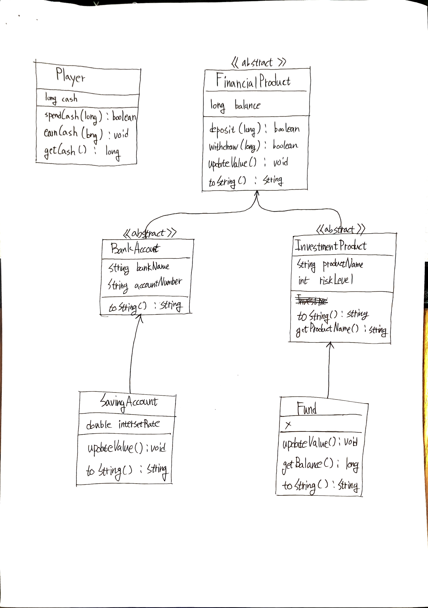

# 카카오테크 부트캠프 - 1주차 Java 과제

## 📝 프로젝트 소개

은행 예금 상품과 펀드 상품을 통해 한 달을 주기로 가상 투자를 경험해보는 콘솔 기반 시뮬레이션입니다.

## ✨ 주요 기능

- **가상 투자**: 초기 자본으로 금융 상품에 투자할 수 있습니다.
- **금융 상품**:
    - **예금**: 안정적인 이자 수익을 제공합니다.
    - **펀드**: 투자 위험도에 따라 수익률이 변동하는 투자 상품입니다.
- **월별 진행**: 한 달 주기로 상품들의 가치가 업데이트되며 결과를 확인할 수 있습니다.

## 도메인 모델 (UML)

## 📂 프로젝트 구조

- `src/main/java`
  - **`domain`**: 핵심 비즈니스 로직을 담고 있는 도메인 클래스 (Player, FinancialProduct 등)
  - **`service`**: 애플리케이션의 핵심 비즈니스 로직을 처리하는 서비스 클래스
  - **`view`**: 사용자와의 상호작용을 담당하는 콘솔 뷰 클래스
  - **`Main.java`**: 프로그램 시작점
